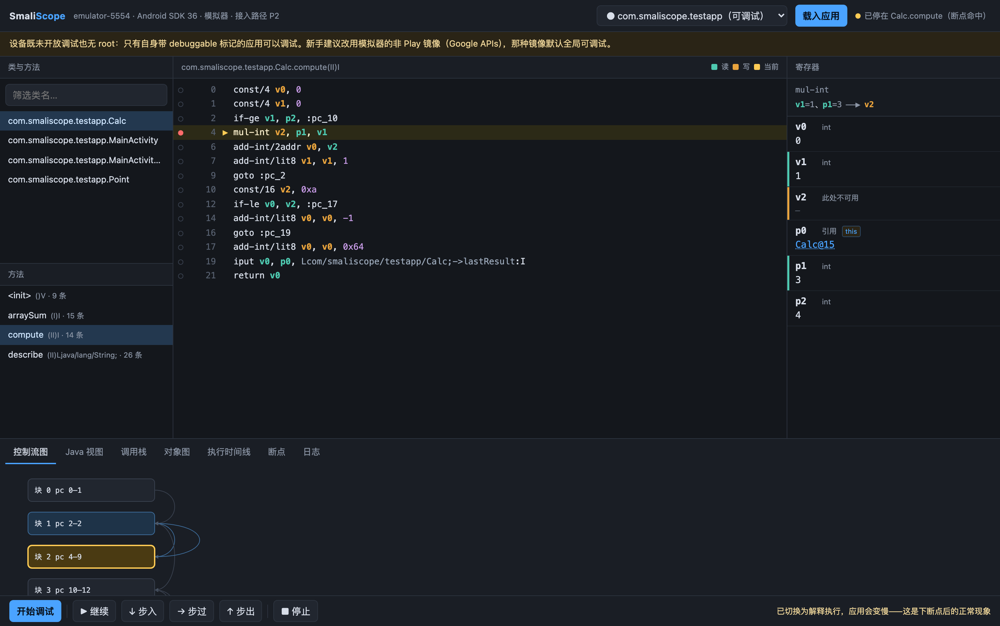
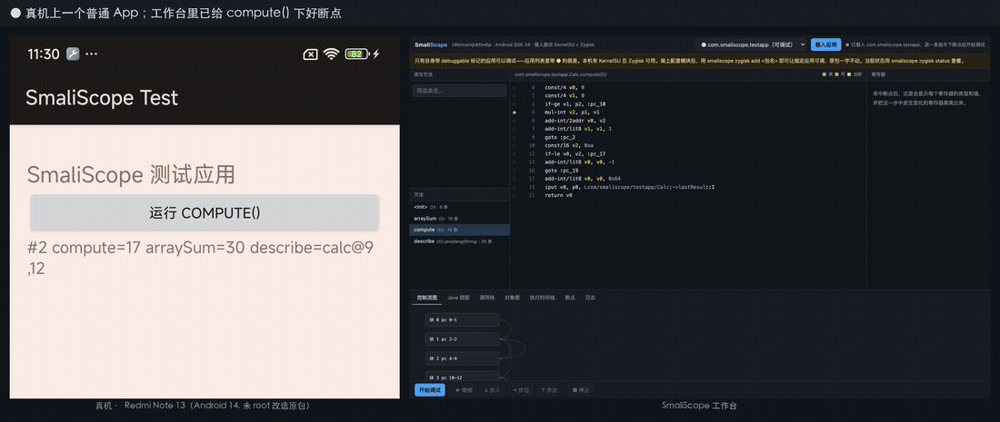
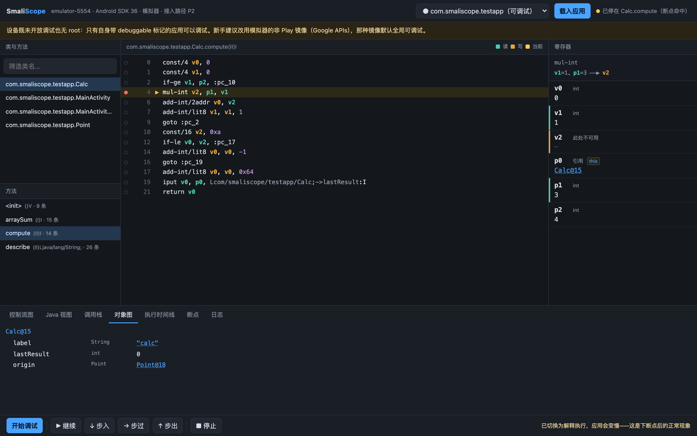
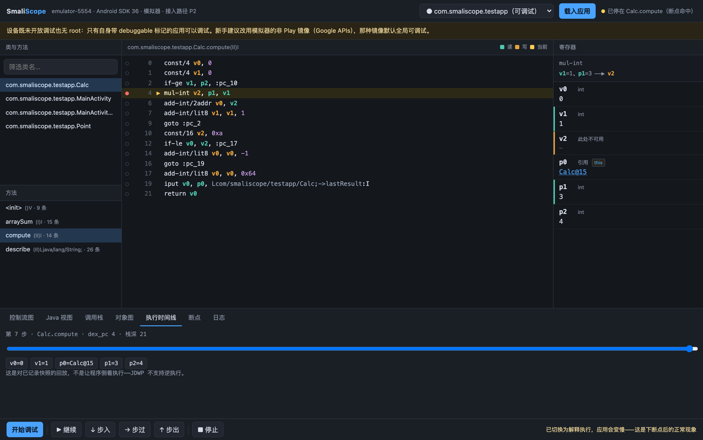
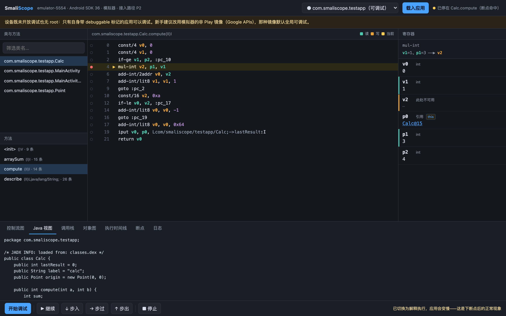

# SmaliScope

面向新手的 DEX/smali 指令级断点调试器。核心卖点：单步时实时看到寄存器变化、执行路径、数据流。

内核：JDWP 指令级断点（`Location.index = dex_pc`）+ dexlib2 静态解析与类型推导 + jadx Java 视图。



> 断点停在 `mul-int v2, p1, v1`。右上角的数据流条写着 `v1=1、p1=3 ──▶ v2`，
> 寄存器面板里参与运算的 `v1`（读，绿）和 `v2`（写，橙）被标了出来，
> `p0` 带着 `this` 标记，底部控制流图里走过的块着蓝、当前块黄框。
> 注意 `v2` 显示的是「此处不可用」而不是 0 —— 读不出来时会说实话。

### 真机实录

在一台 Redmi Note 13（Android 14）上录的：左边是手机屏幕，右边是工作台。
下断点 → 命中（App 被冻结）→ 单步看寄存器变化 → 继续，手机随即画出 `compute=17`。
左右两侧是同一时刻的状态。



> 这段由 [`scripts/record-demo.py`](scripts/record-demo.py) 生成：逐步驱动调试，每一步同时抓
> 手机截图与工作台截图拼成一帧，所以两边天然同步。想换设备或方法，改脚本重跑即可。

## 它解决什么问题

现有工具对新手都不友好：smalidea 配置繁琐、报错晦涩；JADX/JEB 只能看静态；Frida 是方法级 hook，
看不到「一条 smali 指令执行前后寄存器怎么变」。

SmaliScope 只做一件事，做到新手能用：**在任意一条 smali 指令上下断点，单步，然后亲眼看着寄存器的值变化。**

下面是真实输出（`compute(3, 4)`，循环累加 `a*i`）。注意 `v0` 是怎么从 0 变成 1 的：

```
▸ 断点命中  Calc.compute  dex_pc=0  栈深=21
    nop
    p0    引用    Calc@15 (this)
    p1    int    3
    p2    int    4

▸ 单步完成  Calc.compute  dex_pc=8  栈深=21
    add-int/lit8 v0, v0, 1
    ↳ 整数加法
    v0    int    0
    v1    int    0
    ...

▸ 单步完成  Calc.compute  dex_pc=10  栈深=21
    goto :pc_3
    ↳ 无条件跳转。执行会直接跳到目标行，不会走到下一行
    v0    int    1 ←变化
    v1    int    0
```

循环 4 次之后 `v1`（也就是源码里的 `sum`）累加到 18，`18 <= 10` 为假，
于是走进 `sum - 1` 分支得到 **17** —— 与应用日志里打印的 `compute=17` 一致。

Web 工作台把同样的过程做成可视化：执行指针跟着指令走，变化的寄存器脉冲高亮，
CFG 上「走过的路」着色，另有调用栈、对象图和可拖动回看的执行时间线。

### 对象图：点开引用型寄存器，逐层下钻



### 执行时间线：拖回去看任意一步的寄存器状态



这是对**已记录快照的回放**，不是让程序倒着执行——JDWP 不支持逆执行，界面上也直说了这一点。

### Java 视图：用 jadx 看懂逻辑，断点仍下在 smali 侧



---

## 跑起来

### 1. 准备设备

启动一个 Android 模拟器（或连一台手机），确认 adb 能看到它：

```bash
adb devices
```

**关于「哪些应用能调」**：JDWP 只对 debuggable 的进程开放。
**能调的是自身带 `android:debuggable="true"` 的应用**——也就是你自己开发的 debug 包，
这恰好是新手最常见的场景。工具的应用列表里带 ● 的就是当前可调的。

> ⚠️ 网上大量教程说「用非 Play 镜像 / `ro.debuggable=1` 就能调任意应用」，
> **这在现代 Android 上已经不成立**。我在 Android 14 与 16 上逐条验证过：
> 即便 `ro.debuggable=1` 且 `ro.force.debuggable=1`，未改造的 release 包依然不出现在
> `adb jdwp` 里，连 `am set-debug-app -w` 也无效。完整实验见
> [docs/p0-path-findings.md](docs/p0-path-findings.md)。
> 要调别人的 App **没有免改造的捷径**。本项目的做法是 root 下用 Zygisk 模块在进程启动时
> 逐应用打标记，原包一字不动——见下方「调试未改造的第三方应用」。

### 2. 构建并安装自带的测试应用

仓库自带一个测试 App，覆盖了算术、循环、分支、数组、对象、字符串各类指令，专门用来演示调试过程。它带 debuggable 标记，因此在任何镜像上都能调：

```bash
./testapp/build.sh && adb install -r testapp/build/smaliscope-test.apk
```

### 3. 启动工作台

```bash
./gradlew installDist && ./build/install/smaliscope/bin/smaliscope serve
```

浏览器打开 `http://127.0.0.1:8080`，然后：

1. 顶栏选择应用（带 ● 的是当前可调试的），点「载入应用」；
2. 左栏选类 → 选方法，中间会显示带 `dex_pc` 的 smali；
3. 在某条指令左侧点圆点下断点（不知道断哪？底部「断点」页有「一键断在所有 Activity 的 onCreate」等模板）；
4. 点「开始调试」——工具会挂起启动应用并自动 attach；
5. 命中后用「步入 / 步过 / 步出」单步，右侧寄存器面板里**变化的寄存器会高亮**。

## 命令行

工作台之外，同一套内核也有纯文本入口，适合快速验证或写脚本：

```bash
smaliscope smoke                                  # 连通冒烟：握手并打印 VM 信息
smaliscope apps                                   # 列出设备上的应用与环境探测结果
smaliscope dump <包名> [类名] [方法名]              # dump 带 dex_pc 的 smali、CFG、类型推导
smaliscope debug <包名> <类名> <方法名> [步数] [into|over]
                                                  # 下断点 → 挂起启动 → 命中 → 单步打印寄存器
smaliscope audit <包名> <类名> [方法名]             # 统计寄存器可读率
smaliscope mcp                                    # 以 MCP server 运行（stdio）
smaliscope mcp-install                            # 注册进本机 MCP 客户端
smaliscope config [键 [值]] [--test]               # 查看 / 修改配置
smaliscope zygisk <status|install|add|remove|list> # 管理 Zygisk 模块（需 root）
```

例如：

```bash
./build/install/smaliscope/bin/smaliscope debug com.smaliscope.testapp Calc compute 10 over
```

## 作为 MCP server 给 AI agent 用

SmaliScope 实现了标准 **MCP**（Model Context Protocol），可以让 agent 直接驱动调试器。

这件事的意义不在于「加了个 AI 功能」：现有的 AI 逆向工具都停在静态层面——把反编译代码喂给模型让它猜，
因为没有工具能让 agent **真正跑起来看**。接上 MCP 之后，agent 从「读代码猜」变成
「下断点验证」：想知道某个寄存器运行时到底是什么，就在那条指令上断下来读。

一条命令注册到本机的 MCP 客户端：

```bash
./build/install/smaliscope/bin/smaliscope mcp-install
```

它会把 `[mcp_servers.smaliscope]` 写进 `~/.grok/config.toml`（grok-build），
并打印 Claude Code / Cursor 的注册命令。也可以手动跑 `smaliscope mcp`，它走 JSON-RPC over stdio。

暴露 17 个工具：`list_apps` `load_app` `list_classes` `list_methods` `disassemble`
`decompile_java` `set_breakpoint` `list_breakpoints` `remove_breakpoint` `start_debug`
`step` `resume` `read_registers` `read_stack` `expand_object` `set_breakpoint_template` `stop_debug`。

`start_debug` 返回给模型的原文长这样——位置、指令、指令含义、数据流、寄存器实际值一次给全：

```
已启动并命中：断点命中
位置：com.smaliscope.testapp.Calc.compute(II)I  dex_pc=4  栈深=21
当前指令：mul-int v2, p1, v1
指令含义：整数乘法
数据流：读 v1,p1 → 写 v2
寄存器：
  v0   int      0
  v1   int      0
  v2   此处不可用    —
  p0   引用       Calc@15 (this)
  p1   int      3
  p2   int      4
```

注意 `v2` 那行：读不出来时会**明确写出原因**，而不是给个 0 或 null——
让模型把「不可读」误当成「值是 0」会导致它后续推理全错。

> 这里刻意做的是**通用 MCP server**，不是给某一家 agent 定制的适配器。
> MCP 是开放协议，做一次就能被 grok-build、Claude Code、Cursor 等任何客户端使用。

## 可选：接大模型讲解代码

配置一个 OpenAI 兼容的接口后，界面上会多出「AI 解释」标签页，MCP 也会多注册两个工具
（`explain_code`、`suggest_register_names`）。**没配 key 时这些入口整个不出现。**

```bash
smaliscope config llm.apiKey  <你的key>
smaliscope config llm.baseUrl https://claudegpt.org    # 默认 https://claudegpt.org
smaliscope config llm.model   grok-4
smaliscope config --test                          # 测连通性
```

也可用环境变量覆盖：`SMALISCOPE_LLM_BASE_URL` / `SMALISCOPE_LLM_API_KEY` / `SMALISCOPE_LLM_MODEL`。
地址会自动补 `/v1/chat/completions`，填裸域名、带 `/v1` 或完整 endpoint 都行。

它能做两件事：**讲解当前方法**（把 smali、jadx 的 Java、以及运行时寄存器真实值一起作为上下文——
最后一项是纯静态工具给不出的），以及**给混淆包猜寄存器语义名**（结合数据流和调用到的 framework API）。

划定的边界写死在代码里，不要放宽：不进单步热路径（实时性是本项目卖点，一次网络往返就毁了）、
不替代寄存器类型推导（那必须是确定性的，猜错会静默读出垃圾值）、不让模型判断有无漏洞。

> ⚠️ 调用会把 smali、反编译出的 Java 和运行时寄存器值发送到你配置的地址。
> 你调试的往往是**别人的** APK，请确认该地址可信后再启用。

## 调试未改造的第三方应用（需 root + Zygisk）

自带 `android:debuggable="true"` 的应用（也就是你自己开发的 debug 包）零配置即可调试。
要调**别人的 release 包**，需要在进程启动时给它打上可调试标记——`zygisk/` 里的配套模块干这件事，
**原 APK 一字不动**，签名、数据、更新链路全部保留。

```bash
./zygisk/build.sh                                            # 编译并打包（需 NDK）
smaliscope zygisk status                                     # 查 root / Zygisk / 模块状态
smaliscope zygisk install zygisk/build/smaliscope-zygisk.zip  # 装模块（装完重启一次）
smaliscope zygisk add com.example.app                        # 加入名单
adb shell am force-stop com.example.app                      # 强杀后重开即生效
```

模块只做一件事：在 zygote fork 时，给名单里的进程置上
`DEBUG_ENABLE_JDWP | DEBUG_JAVA_DEBUGGABLE`。名单在 `/data/adb/smaliscope/targets`，
只有 root 能写（否则任何应用都能给自己开调试）。改完名单不必重启手机，强杀目标应用即可。

前置条件：Magisk（自带 Zygisk），或 KernelSU / APatch 加装 ZygiskNext。
`zygisk status` 会把缺哪一环说清楚。

> 未改造的第三方 release 包（Element X，官方签名、无 debuggable 标记）经此路径成功调试的
> 完整实测见 [docs/zygisk-thirdparty-findings.md](docs/zygisk-thirdparty-findings.md)；
> 为什么不改 `ro.debuggable` 或重打包重签名，见 [docs/p0-path-findings.md](docs/p0-path-findings.md)。

## 打包成桌面应用

```bash
./gradlew packageApp     # → build/jpackage/，自带 JRE，双击即用
```

用 JDK 自带的 jpackage，不引第三方打包插件。**只能出当前平台的包**：
mac 上 `.dmg`、Windows 上 `.msi`、Linux 上 `.deb`；三平台齐活要在三个系统各跑一次。
双击启动即打开工作台，不需要预装 JDK 或 Gradle。

adb 仍需系统里有：工具会在 `ANDROID_SDK_ROOT` / `PATH` / 各平台默认 SDK 路径下找 adb
并自动 `start-server`，找不到才报错并给出中文指引。

## 测试

```bash
./gradlew test
```

单元测试覆盖不需要设备的部分（签名换算、类型映射、指令词典、JDWP 编解码、JSON 转义）。

需要设备的端到端回归（载入 → 下断点 → 命中 → 单步 → 时间线 → 对象图 → Java 视图），在工作台已启动的前提下跑：

```bash
python3 scripts/e2e.py
```

MCP 侧的端到端回归（握手 → 工具清单 → 载入 → 下断点 → 命中 → 单步），不需要先起工作台：

```bash
python3 scripts/mcp-e2e.py
```

---

## 已实现

| 阶段 | 内容 | 状态 |
|------|------|------|
| M1 | adb server 二进制协议 + JDWP 握手 + VM 信息 | ✅ |
| M2 | dexlib2 加载 APK、类/方法索引、`dex_pc` 偏移表、CFG、读写集 | ✅ |
| M3 | 环境探测 + `am set-debug-app -w` 挂起启动 + 自动 attach | ✅ |
| M4 | 断点引擎 + 类未加载时自动转 pending（CLASS_PREPARE 兜底） | ✅ |
| M5 | 调用栈 / 寄存器读取 + MethodAnalyzer 类型推导 + 对象图 | ✅ |
| M6 | 指令级单步（自研后继计算，不用 JDWP 原生 STEP）+ 寄存器 diff | ✅ |
| M7 | jadx Java 视图 + smali 指令中文词典悬浮解释（覆盖全部 224 条 dex opcode） | ✅ |
| M8 | 执行指针、寄存器高亮、数据流、CFG 走过路径、调用栈、对象图、时间线 | ✅ |
| M9 | 中文错误引导 + jpackage 打包（自带 JRE，双击即用） | ✅ |
| — | 标准 MCP server（16 个工具，供 AI agent 驱动调试） | ✅ |
| — | Zygisk 模块：给名单里的应用打可调试标记，原 APK 不动（真机验证：未改造的 Element X release 包成功命中断点） | ✅ |

## 已知限制：寄存器可读率

ART 校验「读寄存器该用哪个 tag」时，依据的是 dex 调试信息里该 slot **声明**的类型，
而不是它当前实际持有的类型。d8 会把声明为 `int` 的参数寄存器复用去存对象，那几条指令上
就读不出来了。这是平台限制，不是 bug。

已用 `smaliscope audit` 实测量化（详见 [docs/register-readability.md](docs/register-readability.md)）：

| 构建方式 | 总可读率 | 参数 `pN` | 局部 `vN` |
|---|---|---|---|
| `javac -g` | 100 % | 100 % | 100 % |
| `javac -g:none` | 100 % | 100 % | 100 % |
| `javac -g:lines,source`（javac 默认，典型 release） | 95.1 % | 90.1 % | 100 % |
| 再过 R8 `--release`（近似真实发布包） | 96.3 % | 92.4 % | 100 % |

**局部寄存器 `vN` 在所有配置下都 100% 可读**，失败只集中在被复用的参数寄存器上。
读不出来时界面会写明原因，而不是显示 0 或空白——把「不可读」误当成「值是 0」比不显示更糟。

## 实测环境

下面这些结论都在真实设备上跑过，不是纸上推演。核心链路（下断点 → 命中 → 单步 → 读寄存器）
在两类环境都验证通过：

| 设备 | 系统 | 关键属性 | root / Zygisk | 用途 |
|------|------|----------|---------------|------|
| Redmi Note 13 5G（`2312DRAABC`） | Android 14（SDK 34）· arm64-v8a | `build.type=user`、`ro.debuggable=0` | KernelSU 3.1.8（zakozako）+ ZygiskNext | 最真实的生产环境；验证 Zygisk 方案 |
| AVD `google_apis`（非 Play 镜像） | Android 14（SDK 34）· arm64-v8a | `build.type=userdebug`、`ro.debuggable=1` | 有 su，无 Zygisk | 验证 P0 前提证伪、寄存器可读率 |
| AVD `google_apis_playstore` | Android 16（SDK 36）· arm64-v8a | Play 镜像、`ro.debuggable=0` | 无 | M1–M8 主要开发环境 |

在真机上验证到的两件关键事实：

- **未改造的第三方 release 包可调试**——装上 Zygisk 模块后，把 Element X（官方签名、
  manifest 里没有 `debuggable` 标记）加入名单，即命中 `Application.onCreate` 并单步读到寄存器；
  调试后其签名与 manifest 均未改变，可调试完全来自运行时 flag。
- **`ro.debuggable` 那条路确实走不通**——真机上 `su -c 'setprop ro.debuggable 1'` 失败
  （`ro.*` 一次性写入），未改造应用也始终不在 `adb jdwp` 里。详见
  [docs/p0-path-findings.md](docs/p0-path-findings.md)。

寄存器可读率在真机（Android 14）与模拟器（Android 14 / 16）上逐项一致，说明那批数字不是
模拟器特有产物；完整数据见 [docs/register-readability.md](docs/register-readability.md)。

## 尚未实现

- **jpackage 目前只在 macOS 上出过包**（.dmg）。Windows 的 .msi、Linux 的 .deb
  需要在对应系统上各跑一次 `./gradlew packageApp`（jpackage 的固有限制），尚未实测。
- 寄存器写入、条件断点、表达式求值（设计方案里本就列为二期）。
- **platform-tools 自动下载**。现在的做法是：连不上 adb server 时自动在常见位置找 adb 并
  拉起它（`ANDROID_SDK_ROOT`、`PATH`、各平台默认 SDK 路径），找不到才报错并给出中文指引。
  刻意没做「自动联网下载」——那要替用户决定下载什么，留给使用者自己装。

## 与设计方案的偏差

- **SSE 代替 WebSocket**：状态推送本来就是单向的（内核 → 前端），命令走普通 HTTP。SSE 在 JDK 自带的 `HttpServer` 上二十行就能实现，而手写 RFC 6455 的分帧、掩码、心跳和关闭握手要多几百行，对本项目没有额外收益。
- **数据流用「数据流条」而非跨栏连线**：代码区与寄存器面板紧贴，中间没有横向空间画曲线，连线会糊在分栏边界上。改成显式的一行 `v1=0、p1=3 ──▶ v2`，同样表达「谁参与运算、结果去哪」，而且带上了实时值。
- 内核包名用 `analysis/` 而非设计方案里的 `static/`（`static` 是 Java 关键字，留着容易在互操作时踩坑）。
- **加了 MCP server**：设计方案 §1.3 把「不做 MCP/Agent」列为非目标，那条是为了守住「只把断点单步
  做到新手能用」这个边界。MCP 没有动主线的任何东西（Web 工作台与 MCP 共用同一个 `Debugger` 门面），
  但它确实把服务对象从「新手」扩展到了「agent」，属于有意识的范围扩张，记在这里。

## 目录

```
src/main/kotlin/com/smaliscope/
  adb/          直连 adb server 二进制协议：devices / jdwp / forward / shell / sync 拉包
  jdwp/         握手、packet 编解码、事件循环、各命令集（cmdSet 1/2/3/6/9/10/11/13/15/16/64）
  analysis/     dexlib2：APK 索引、反汇编、dex_pc 表、CFG、读写集、寄存器类型推导
  breakpoint/   断点引擎 + pending 兜底 + 单步用的临时断点
  stepping/     指令级单步：后继计算 + 栈深校验
  frame/        帧 / 寄存器 / 对象图读取
  session/      会话编排、设备与应用探测、推给前端的视图模型
  decompile/    jadx 按需反编译
  dict/         smali 指令中文词典（覆盖全部 dex opcode，DictCoverageTest 守覆盖率）
  server/       本地 HTTP + SSE 工作台；极简 JSON 读写
  mcp/          标准 MCP server（JSON-RPC over stdio）与工具集
  config/       本地配置（大模型接口地址与 key）
  explain/      可选的大模型讲解：OpenAI 兼容客户端 + 提示词构造
src/main/resources/web/    前端（无框架，原生 JS/CSS/SVG）
testapp/                   自带的 debuggable 测试应用（aapt2 + javac + d8 手工构建）
zygisk/                    Zygisk 模块（C++）：给名单里的应用打可调试标记
scripts/e2e.py             Web 侧端到端回归（需设备）
scripts/mcp-e2e.py         MCP 侧端到端回归（需设备）
scripts/shots.py           重新生成 README 里的界面截图（Chrome headless + CDP）
scripts/record-demo.py     录「真机 + 工作台」并排演示 gif/mp4（需真机 + Chrome + ffmpeg）
docs/images/               界面截图
docs/register-readability.md  寄存器可读率实测报告
```

设计细节见 [`Smali断点调试器-系统设计方案.md`](Smali断点调试器-系统设计方案.md)，
下一阶段计划见 [`ROADMAP.md`](ROADMAP.md)。

---

## 赞助鸣谢（下面的服务都是大家日常需要的哦！）

[](https://claudegpt.org)

**[ClaudeGPT](https://claudegpt.org)** —— 一个正版靠谱稳定的 AI 代理。
联系方式 QQ：89066216

**[Fridare](https://github.com/suifei/fridare)** —— 强大的 Frida 重打包工具，用于 iOS 和 Android。轻松修改 Frida 特征，增强隐蔽性，绕过检测。简化逆向工程和安全测试。
Powerful Frida repackaging tool for iOS and Android. Easily modify Frida servers to enhance stealth and bypass detection. Streamlines reverse engineering and security testing.
联系方式 QQ 群：555354813
